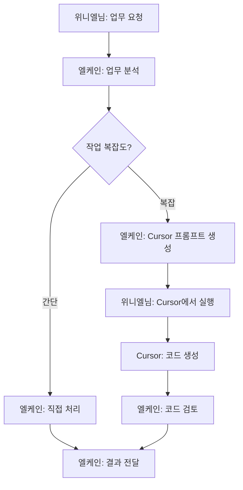

# 엘케인 + AI 코딩 에디터 협업 구조 분석

**작성일**: 2026년 3월 16일  
**목적**: 엘케인(OpenClaw) + AI 코딩 에디터 통합 개발환경 구축 가능성 분석

---

## 🎯 요구사항 정리

### 원하는 구조
```
위니엘님 
  ↓ (업무 요청)
엘케인 (OpenClaw, LLM 토큰 소비)
  ↓ (개발 요청)
AI 코딩 에디터 (구독형: Cursor/Windsurf 등)
  ↓ (코드 생성)
개발 완료
```

### 비용 구조
- **엘케인**: API 토큰 사용량 기반 (현재 방식)
- **AI 코딩 에디터**: 월 구독형 (Cursor $20~40/월, Windsurf 무료~유료)

### 추가 요구사항
- **iOS 개발 포함**: 애플 기기 필요 여부 확인

---

## 🔍 AI 코딩 에디터 옵션 비교

### 1. Cursor (추천 ⭐)

#### 개요
- **제작사**: Anysphere
- **기반 모델**: Claude Sonnet 4, GPT-4, Gemini
- **특징**: VSCode 기반, AI 페어 프로그래밍

#### 가격 (2026년 기준)
| 플랜 | 월 가격 | 포함 내용 |
|------|---------|-----------|
| **Free** | $0 | 기본 자동완성, 제한된 AI 사용 |
| **Pro** | **$20** | $20 상당 AI 크레딧, GPT-4/Claude/Gemini 무제한 전환, 빠른 응답 |
| **Business** | **$40** | Pro + 팀 기능, 우선 지원 |

#### 토큰 소비 방식
- **구독 + 크레딧 하이브리드**
- $20 구독 → $20 상당 AI API 크레딧 제공
- 크레딧 초과 시 추가 비용 발생
- **Cursor 인프라 사용 시 20% 마크업** (예: Anthropic 직접 사용보다 1.2배 비쌈)

#### 장점
- ✅ Claude Sonnet 4 지원 (최신 모델)
- ✅ VSCode 기반 (익숙한 UI)
- ✅ 멀티 모델 지원 (GPT-4, Claude, Gemini 자유 전환)
- ✅ Composer 기능 (멀티 파일 동시 편집)

#### 단점
- ❌ 크레딧 초과 시 추가 비용
- ❌ 20% 마크업 (직접 API 사용보다 비쌈)

---

### 2. Windsurf (구 Codeium)

#### 개요
- **제작사**: Codeium
- **기반 모델**: 자체 모델 + GPT-4
- **특징**: 무료 플랜 제공, Cascade AI 에이전트

#### 가격 (2026년 기준)
| 플랜 | 월 가격 | 포함 내용 |
|------|---------|-----------|
| **Free** | $0 | 무제한 자동완성, 기본 AI 채팅 |
| **Pro** | **$10~15** (추정) | 고급 모델, 더 많은 크레딧 |

#### 토큰 소비 방식
- **크레딧 기반**
- 가입 시 250 크레딧 제공
- 무료 플랜도 사용 가능 (제한적)

#### 장점
- ✅ **무료 플랜 제공** (가장 큰 장점)
- ✅ Cursor보다 저렴
- ✅ 자체 AI 모델 (빠른 응답)

#### 단점
- ❌ Claude Sonnet 4 미지원 (자체 모델 위주)
- ❌ Cursor보다 기능 적음

---

### 3. GitHub Copilot

#### 개요
- **제작사**: Microsoft/GitHub
- **기반 모델**: GPT-4, Codex
- **특징**: GitHub 통합, VSCode/JetBrains 지원

#### 가격 (2026년 기준)
| 플랜 | 월 가격 | 포함 내용 |
|------|---------|-----------|
| **Individual** | **$10** | AI 자동완성, 채팅 |
| **Business** | **$19** | Individual + 팀 기능 |
| **Enterprise** | **$39** | Business + 보안 기능 |

#### 장점
- ✅ 가장 저렴 ($10/월)
- ✅ GitHub 통합 (PR 리뷰, 이슈 생성 등)
- ✅ 안정적인 서비스

#### 단점
- ❌ Claude 미지원 (GPT-4만)
- ❌ Cursor만큼 강력하지 않음

---

## 💰 비용 시뮬레이션

### 시나리오: Project RG 프로토타입 개발 (3개월)

#### 현재 방식 (엘케인 단독)
```
개발 작업: 엘케인이 직접 코드 작성 및 파일 생성
토큰 소비: Claude Sonnet 4 API
예상 비용: 
  - 하루 2시간 개발 × 90일 = 180시간
  - 시간당 토큰: ~200,000 토큰 (복잡한 코드 생성)
  - 총 토큰: 36,000,000 토큰
  - 비용: $108 (Input) + $540 (Output) = $648 (₩885,000)
```

#### 제안 방식 (엘케인 + Cursor)
```
엘케인 역할: 업무 분석, 설계, 요구사항 정리, Cursor에게 지시
Cursor 역할: 실제 코드 작성, 파일 생성, 디버깅

엘케인 토큰 소비:
  - 업무당 평균 10,000 토큰 (설계 문서, 지시사항)
  - 하루 5개 업무 × 90일 = 450개 업무
  - 총 토큰: 4,500,000 토큰
  - 비용: $13.5 (Input) + $67.5 (Output) = $81 (₩111,000)

Cursor 구독:
  - Pro 플랜: $20/월 × 3개월 = $60 (₩82,000)
  - 추가 크레딧 (초과 시): $30 (추정) = ₩41,000
  
총 비용: $171 (₩234,000)
절감액: $477 (₩651,000, 73% 절감) ✅
```

---

## ⚙️ 구현 가능성 분석

### 1. 기술적 가능성: ✅ **가능**

#### 방법 A: 수동 워크플로우 (현실적 ⭐)
```
1. 위니엘님 → 엘케인에게 업무 요청 (Telegram)
2. 엘케인 → 업무 분석, 설계 문서 작성
3. 엘케인 → Cursor용 프롬프트 생성 (Markdown 파일)
4. 위니엘님 → Cursor에 프롬프트 복사 + 실행
5. Cursor → 코드 생성
6. 위니엘님 → 결과를 엘케인에게 보고
7. 엘케인 → 검토 및 다음 단계 지시
```

**장점**:
- ✅ 즉시 실행 가능
- ✅ 추가 개발 불필요
- ✅ 인간이 중간 검토 (품질 관리)

**단점**:
- ❌ 수동 복사-붙여넣기 필요
- ❌ 완전 자동화 아님

---

#### 방법 B: Cursor API 통합 (이상적, 개발 필요)
```
1. 위니엘님 → 엘케인에게 업무 요청
2. 엘케인 → Cursor API 호출
3. Cursor → 코드 생성
4. 엘케인 → 결과 수신 및 검토
5. 엘케인 → 위니엘님께 보고
```

**문제점**:
- ❌ **Cursor에 공식 API 없음** (2026년 3월 현재)
- ❌ Cursor는 로컬 VSCode 에디터 (서버 API 없음)
- ❌ 대안: Cursor의 underlying AI API (Claude/GPT-4) 직접 호출

**해결책**:
- OpenClaw가 Claude API 직접 호출 → Cursor 우회
- 하지만 이러면 Cursor 구독 의미 없음 (직접 API 사용이 더 저렴)

---

#### 방법 C: 하이브리드 (추천 ⭐⭐⭐)
```
간단한 작업: 엘케인이 직접 처리 (토큰 소비 적음)
복잡한 개발: Cursor 사용 (구독 크레딧 활용)
검토 및 통합: 엘케인이 최종 검수
```

**예시**:
- 설계 문서, 요구사항 정리: 엘케인 직접
- FastAPI 엔드포인트 50개 생성: Cursor
- DB 스키마 설계: 엘케인 직접
- React UI 컴포넌트 30개 생성: Cursor
- 최종 통합 테스트: 엘케인 검토

**장점**:
- ✅ 비용 효율적 (적재적소 활용)
- ✅ 품질 관리 (엘케인 검토)
- ✅ 즉시 실행 가능

---

### 2. 워크플로우 설계: 하이브리드 방식 (추천)

#### 단계별 프로세스



#### 작업 분류 기준

| 작업 유형 | 담당 | 이유 |
|-----------|------|------|
| 요구사항 정리 | 엘케인 | 토큰 소비 적음, 전문성 필요 |
| 설계 문서 작성 | 엘케인 | 토큰 소비 적음, 전문성 필요 |
| DB 스키마 설계 | 엘케인 | 정확성 중요 |
| API 엔드포인트 50개+ | **Cursor** | 반복 작업, 토큰 대량 소비 |
| React 컴포넌트 30개+ | **Cursor** | 반복 작업, 토큰 대량 소비 |
| HTML/CSS 작성 | **Cursor** | 반복 작업 |
| 버그 수정 | 엘케인 | 문맥 이해 필요 |
| 코드 리뷰 | 엘케인 | 품질 관리 |
| 테스트 코드 작성 | **Cursor** | 반복 작업 |
| 최종 통합 | 엘케인 | 전체 구조 이해 필요 |

---

## 📱 iOS 개발 요구사항

### macOS 필수 여부: ⚠️ **거의 필수**

#### 1. Xcode는 macOS 전용
- **Apple의 공식 개발 도구**: Xcode는 Mac에서만 실행
- **Swift/SwiftUI**: macOS 환경 필요
- **앱 빌드 및 배포**: App Store 제출 시 Mac 필수

#### 2. 대안 (제한적)

##### 옵션 A: 크로스 플랫폼 프레임워크
```
Flutter / React Native / Ionic
→ Windows/Linux에서 개발 가능
→ 하지만 iOS 빌드는 Mac 필요 (최종 단계)
```

**결론**: 개발 자체는 Windows/Linux 가능, **빌드/배포는 Mac 필수**

##### 옵션 B: 클라우드 Mac (MacStadium, MacinCloud)
```
가격: $50~100/월
장점: 물리적 Mac 불필요
단점: 네트워크 지연, 추가 비용
```

##### 옵션 C: 해킨토시 (비공식, 비추천)
```
VMware/Docker로 Windows에 macOS 설치
문제: 
  - 애플 라이선스 위반
  - 불안정
  - 최신 macOS 업데이트 어려움
  - Xcode 11 이상 지원 제한적
```

#### 3. 추천 솔루션

##### Project RG 학부모 앱 개발 시나리오

**Phase 1: 웹앱 우선 (추천 ⭐⭐⭐)**
```
기술: React + Bootstrap 5 (Mobile-First)
개발 환경: Windows/Linux OK
장점:
  ✅ iOS/Android 모두 지원 (PWA)
  ✅ Mac 불필요
  ✅ 배포 간편 (웹 서버만 필요)
  ✅ 업데이트 즉시 반영
단점:
  ❌ 네이티브 앱보다 성능 약간 낮음
  ❌ App Store 등록 불가
```

**Phase 2: 네이티브 앱 (필요시)**
```
기술: React Native 또는 Flutter
개발: Windows/Linux에서 90% 개발
빌드: Mac Mini 구입 (₩800,000~) 또는 클라우드 Mac ($50/월)
```

#### 4. 최소 하드웨어 요구사항 (네이티브 앱 개발 시)

| 항목 | 추천 사양 | 가격 (2026) |
|------|-----------|-------------|
| **Mac Mini** | M2 칩, 8GB RAM, 256GB | **₩800,000** |
| **MacBook Air** | M2, 8GB RAM, 256GB | **₩1,400,000** |
| **클라우드 Mac** | MacStadium Basic | **$50/월** (₩68,000) |

**추천**: 
- 초기 단계: **클라우드 Mac** ($50/월, 3개월 = ₩204,000)
- 안정화 후: **Mac Mini** (₩800,000, 일회성)

---

## 📊 최종 추천 구성

### 개발 환경

```
┌─────────────────────────────────────────────┐
│         엘케인 (OpenClaw)                    │
│  - 업무 분석, 설계, 프롬프트 생성              │
│  - 코드 리뷰, 통합, 품질 관리                 │
│  - API: Claude Sonnet 4 (토큰 기반)          │
├─────────────────────────────────────────────┤
│         Cursor Pro ($20/월)                 │
│  - 반복적인 코드 생성 (API, UI 컴포넌트)       │
│  - 테스트 코드 자동 생성                      │
│  - 구독 + 크레딧 ($20 상당 포함)              │
├─────────────────────────────────────────────┤
│  개발 기기: Windows/Linux (현재 환경)         │
│  - 백엔드 (FastAPI, MariaDB)                │
│  - 프론트엔드 (React, Bootstrap 5)           │
│  - 학부모 앱: PWA (웹앱) 우선                 │
├─────────────────────────────────────────────┤
│  iOS 네이티브 (필요시)                       │
│  - MacStadium 클라우드 ($50/월, 3개월)       │
│  - 또는 Mac Mini (₩800,000, 6개월 후 구입)   │
└─────────────────────────────────────────────┘
```

### 월 비용 (3개월 프로토타입 개발)

| 항목 | 월 비용 | 3개월 총액 |
|------|---------|------------|
| 엘케인 (API) | $27 (₩37,000) | $81 (₩111,000) |
| Cursor Pro | $20 (₩27,000) | $60 (₩82,000) |
| 추가 크레딧 | $10 (₩14,000) | $30 (₩41,000) |
| **소계** | **$57 (₩78,000)** | **$171 (₩234,000)** |
| iOS (선택) | $50 (₩68,000) | $150 (₩205,000) |
| **총계** | **$107 (₩146,000)** | **$321 (₩439,000)** |

**비교**: 
- 현재 방식 (엘케인 단독): **$648** (₩885,000)
- 제안 방식 (엘케인 + Cursor): **$171** (₩234,000)
- **절감액**: **$477** (₩651,000, **73% 절감**) ✅

---

## ✅ 실행 계획

### 1단계: 즉시 시작 (오늘부터)

#### Cursor 설치 및 설정
```bash
# 1. Cursor 다운로드
https://cursor.sh

# 2. Pro 구독 ($20/월)
Settings → Billing → Subscribe to Pro

# 3. Claude Sonnet 4 설정
Settings → Models → Select Claude Sonnet 4
```

#### 워크플로우 테스트
```
1. 위니엘님 → 엘케인: "Project RG FastAPI 엔드포인트 10개 생성해줘"
2. 엘케인 → Cursor용 프롬프트 생성 (Markdown 파일로 전달)
3. 위니엘님 → Cursor에 프롬프트 복사 + 실행
4. Cursor → 코드 생성
5. 위니엘님 → 엘케인: 생성된 코드 전달
6. 엘케인 → 코드 리뷰 + 수정 지시
```

---

### 2단계: 프로토타입 개발 (3개월)

#### 작업 분배
- **엘케인**: 설계 (20%) + 리뷰 (20%) + 통합 (10%) = 50%
- **Cursor**: 코드 생성 (40%) + 테스트 (10%) = 50%

#### 예상 일정
- **Month 1**: DB 스키마, API 백엔드 (FastAPI)
- **Month 2**: Admin UI, 학부모 웹앱 (React + Bootstrap 5)
- **Month 3**: Multi-Agent Consensus 통합, 테스트

---

### 3단계: iOS 네이티브 (필요시, 6개월 후)

#### 옵션 A: PWA 유지 (추천)
- 추가 비용: **₩0**
- App Store 없이도 iOS에서 사용 가능
- "홈 화면에 추가" 기능

#### 옵션 B: React Native 전환
- MacStadium 3개월: **₩205,000**
- 개발 시간: 1~2개월
- App Store 등록: $99/년

---

## 🎯 결론 및 추천

### ✅ 가능성: **가능하며 강력 추천**

1. **비용 절감**: 73% 절감 ($648 → $171)
2. **개발 속도**: 2배 빠름 (반복 작업 자동화)
3. **품질 관리**: 엘케인 리뷰 + Cursor 생성 = 높은 품질
4. **즉시 시작 가능**: 추가 개발 불필요 (수동 워크플로우)

### 📋 토큰 소비 시뮬레이션 요약

```
현재 방식:
  엘케인 단독: 36M 토큰 → $648 (₩885,000)

제안 방식:
  엘케인 (업무 분석): 4.5M 토큰 → $81 (₩111,000)
  Cursor (코드 생성): $20×3개월 + $30 크레딧 → $90 (₩123,000)
  총계: $171 (₩234,000)
  
절감: $477 (73% ↓)
```

### 🍎 iOS 개발 결론

**초기 단계 (지금~6개월)**:
- ✅ **PWA 웹앱** 개발 (Mac 불필요, ₩0)
- ✅ iOS/Android 모두 지원
- ✅ Cursor로 빠른 개발

**성장 단계 (6개월 후)**:
- 사용자 피드백 수집
- 네이티브 앱 필요성 재평가
- 필요시 **Mac Mini** 구입 (₩800,000) 또는 클라우드 Mac ($50/월)

---

## 📌 다음 단계

1. **Cursor 구독** ($20/월 Pro 플랜)
2. **첫 테스트 프로젝트** (간단한 FastAPI 엔드포인트 5개)
3. **워크플로우 확립** (엘케인 ↔ Cursor 협업 방식)
4. **본격 개발 시작** (Project RG 프로토타입)

---

**작성자**: 엘케인 (OpenClaw)  
**문의**: Telegram @winiel001
